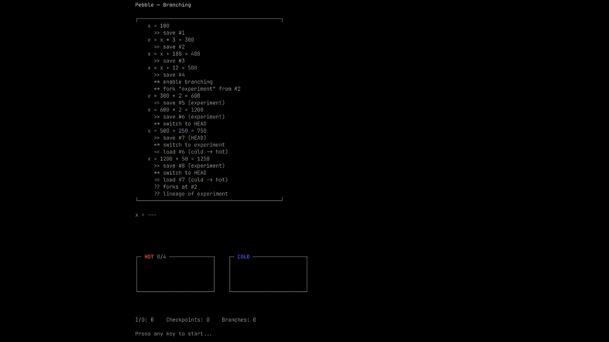

# pebble

O(sqrt(T)) checkpoint management using the Red-Blue Pebble Game algorithm.

## Features

- **O(sqrt(T)) space** - Bounded memory with sqrt(T) checkpoints
- **O(sqrt(T)) replay** - Reconstruct any state in at most sqrt(T) operations
- **no_std by default** - Works in embedded environments (requires `alloc`)
- **Immutable checkpoints** - Once added, checkpoints cannot be mutated, guaranteeing safe rebuilds
- **Pluggable storage** - Abstract over flash, disk, or custom backends
- **Warm recovery** - Rediscover surviving checkpoints and rebuild the DAG automatically
- **Branching** - Fork from any historical checkpoint and track branch lineage

## Usage

Implement `Checkpointable` and `CheckpointSerializer` for your type, then pass them to `PebbleManager` or use the builder ([example](examples/basic.rs)).

## How It Works

Pebble implements the Red-Blue Pebble Game, a model for space-time tradeoffs:

```
Events:      [1] [2] [3] [4] [5] [6] [7] [8] [9] [10] ... [100]
                  |           |           |            |
Checkpoints:     [2]         [5]         [8]         [10]
                  |           |           |            |
             Red pebble  Red pebble  Blue pebble   Red pebble
             (in memory) (in memory) (serialized)  (in memory)
```

**Red pebbles** are checkpoints in fast memory — instant access, bounded space. **Blue pebbles** are checkpoints in storage — requires I/O, unbounded space. The algorithm automatically decides which to keep and which to evict.

## The Dependency Graph

Pebble tracks how checkpoints relate to each other using a DAG,  directed acyclic graph.  Pebble records when a checkpoit is created along with its origin. Over time, this forms a graph of dependencies that the algo uses to make eviction and rebuild decisions. If a checkpoint gets evicted from fast memory, pebble walks the graph to find the cheapest way to reconstruct it from what's available. This  prevents it from evicting a checkpoint that others depend on, which would be cheap to keep but expensive to lose.

## Hot and Cold Storage

Checkpoints live in one of two places. Hot storage keeps them in memory where access is immediate. Cold storage serializes them to a backend you provide, whether that's flash, disk, or a custom destination.

Hot storage has a fixed capacity, typically around the square root of your total checkpoint count. When it fills up, pebble consults the dependency graph to decide what to evict. Evicted checkpoints get serialized and written to cold storage, and when they're needed again pebble deserializes them back into memory.

The cold backend is pluggable through the `ColdTier` trait. If your backend supports it, pebble can also recover from a restart by walking persisted metadata and rebuilding the dependency graph from what it finds on disk.

### See It In Action

<p align="center">
  
</p>

## Why not an LRU?

An LRU cache evicts whichever item was *least recently used*. That works when every item is equally cheap to recompute. Checkpoints aren't — some are roots checkpoints depend on, some sit are on critical paths, and some are cheap leaves.

Pebble uses the dependency graph to make eviction decisions:

- **An LRU** would evict a root checkpoint that hasn't been touched in a while, even though reloading it later means replaying the entire chain that depends on it.
- **Pebble** keeps that root hot because the DAG shows it has many dependents, and evicts a leaf that's cheap to rebuild instead.

The result is fewer I/O round-trips to storage for the same amount of fast memory. For tree-shaped computations, the strategy is provably within 2x of optimal I/O. For general DAGs, it stays within a 3x budget.

## Strategies

| Strategy | Space | I/O Bound | Use Case |
|----------|-------|-----------|----------|
| `TreeStrategy` | O(sqrt(T)) | 2-approximation | Tree-shaped dependencies |
| `DAGStrategy` | O(sqrt(T)) | 3x budget | General DAGs |

## Feature Flags

| Feature | Default | Description |
|---------|---------|-------------|
| `cold-buffer` | yes | `RingCold` ring-buffered cold tier |
| `cold-buffer-std` | | `ParallelCold` multi-threaded I/O (implies `cold-buffer`) |
| `bytecast` | | Zero-copy `BytecastSerializer` adapter |
| `verdict` | | `Actionable` error impls for retry integration |

## References

Pebble implements the Red-Blue Pebble Game model from Hong & Kung (1981), using leaf-count 2-approximation results from Gleinig & Hoefler (2022) for tree eviction. The sqrt(T) space bound is motivated by recent breakthroughs in space-efficient simulation.

- Hong & Kung, ["I/O complexity: The red-blue pebble game"](https://dl.acm.org/doi/10.1145/800076.802486) (STOC 1981) — the foundational I/O complexity model
- Gleinig & Hoefler, ["The red-blue pebble game on trees and DAGs with large input"](https://htor.inf.ethz.ch/publications/img/PebbleTrees.pdf) (Euro-Par 2022) — proves leaf-count is a 2-approximation for optimal I/O on trees
- Williams, ["Simulating Time in Square-Root Space"](https://eccc.weizmann.ac.il/report/2025/017/) (ECCC 2025) — proves DTIME(t) can be simulated in O(sqrt(t log t)) space
- Cook & Mertz, ["Pebble Games and Complexity"](https://dl.acm.org/doi/10.1145/3618260.3649664) (STOC 2024) — tree evaluation in O(log n * log log n) space
- Mertz, ["Reusing Space: Pebbling and Simulation"](https://iuuk.mff.cuni.cz/~iwmertz/papers/m23.reusing_space.pdf) (2023) — theoretical pebbling and simulation results
- Fortnow, ["You Need Much Less Memory Than Time"](https://blog.computationalcomplexity.org/2025/02/you-need-much-less-memory-than-time.html) — accessible overview of the sqrt space results

## License

Licensed under either of [MIT](../LICENSE-MIT) or [Apache 2.0](../LICENSE-APACHE) at your option.
